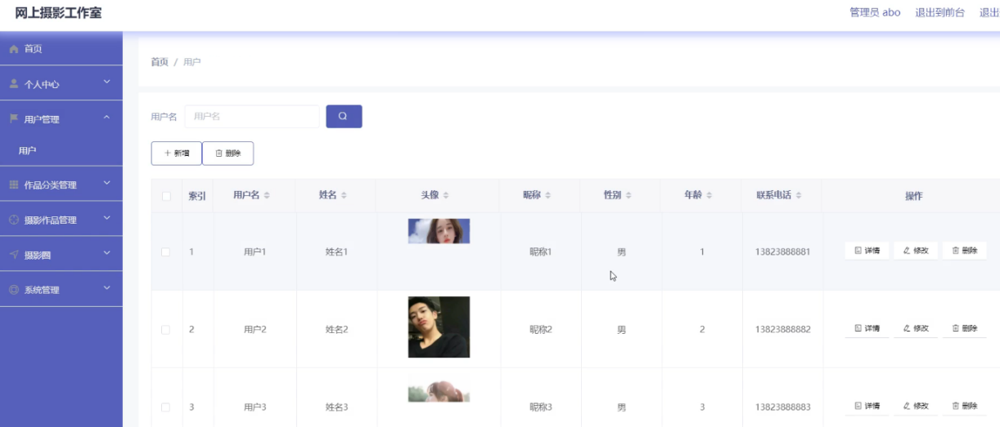

# springboot092-网上摄影工作室的开发与实现

>  博主介绍：
>  Hey，我是程序员Chaers，一个专注于计算机领域的程序员
>  十年大厂程序员全栈开发‍ 日常分享项目经验 解决技术难题与技术推荐 承接各类网站设计，小程序开发，毕设等。
>  【计算机专业课程设计，毕业设计项目，Java，微信小程序，安卓APP都可以做，不仅仅是计算机专业，其它专业都可以】

## 3000套系统可挑选，获取链接：https://chaerspol.github.io/

<b>QQ【获取完整源码】：674456564</b>

<b>QQ群【获取完整源码】：1058861570</b>

### 系统架构

> 前端：html | js | css | jquery | vue
>
> 后端：springboot | mybatis
> 
> 环境：jdk1.8+ | mysql | maven

# 一、内容包括
包括有  项目源码+项目论文+数据库源码+答辩ppt+远程调试成功

# 二、运行环境

> jdk版本：1.8 及以上； ide工具：IDEA； 数据库: mysql5.7及以上；编程语言: Java

# 三、需求分析

**3.1可行性分析**

通过对本网上摄影工作室实行的目的初步调查和分析，提出可行性方案并对其一一进行论证。我们在这里主要从技术可行性、经济可行性、操作可行性等方面进行分析。

**3.1.1技术可行性**

本网上摄影工作室采用SpringBoot框架，JAVA作为开发语言，是基于WEB平台的B/S架构系统。

（1）Java提供了稳定的性能、优秀的升级性、更快速的开发、更简便的管理、全新的语言以及服务。整个系统帮用户做了大部分不重要的琐碎的工作。

（2）基于B/S模式的系统的开发已发展日趋成熟。

（3）众所周知，Java是面向对象的开发语言。程序开发员可以在Eclipse平台上面方便的使用一些已知的解决方案。    

因此，网上摄影工作室在开发技术上具有很高可行性，且开发人员掌握了一定的开发技术，所以此系统的开发技术具有可行性。

**3.1.2经济可行性**

本网上摄影工作室采用的软件都是开源的，这样能够削减很多的精力和资源，降低开发成本。同时对计算机的配置要求也极低，即使是淘汰下来的计算机也能够满足需要，因此，本系统在经济上是完全具有可行性的，所以在经济上是十分可行的。

**3.1.3操作可行性**

本网上摄影工作室的界面简单易操作，用户只要平时有在用过电脑，都能进行访问和操作。本系统具有易操作、易管理、交互性好的特点，在操作上是非常简单的，因此在操作上具有很高的可行性。
综上所述，此系统开发目标已明确，在技术、经济和操作方面都具有很高的可行性，并且投入少、功能完善、管理方便，因此系统的开发是完全可行的。

**3.2系统性能分析**

**3.2.1 系统安全性**

此网上摄影工作室要严格控制管理权限，具体要求如下：

（1）要想对网上摄影工作室进行管理，首先要依靠用户名和密码在系统中登陆，无权限的用户不可以通过任何方式登录系统和对系统的任何信息和数据进行查看，这样可以保证系统的安全可靠性和准确性。

（2）在具体实现中对不同的权限进行设定，不同权限的用户在系统中登陆后，不可以越级操作。

**3.2.2 数据完整性**

（1）所有记录信息要保持全面，信息记录内容不可以是空。

（2）各种数据间相互联系要保持正确。

（3）相同数据在不同记录中要保持一致。

**3.3系统界面分析**

目前，界面设计已经成为对软件质量进行评价的一条关键指标，一个好的用户界面可以使用户使用系统的信心和兴趣增加，从而使工作效率提高，JSP技术是将JAVA语言作为脚本语言的，JSP网页给整个服务器端的JAVA库单元提供了一个接口用来服务HTTP的应用程序。创建动态页面比较方便。客户界面是指软件系统与用户交互的接口，往往涵盖输出、输入、人机对话的界面格式等。

1.输出设计

输出是由电脑对输入的基本信息进行解决，生成高质量的有效信息，并使之具有一定的格式，提供给管理者使用，这是输出设计的主要责任和目标。
系统开发的过程与实施过程相反，并不是从输入设计到输出设计，而是从输出设计到输入设计。这是由于输出表格与使用者直接相联系，设计的目的应当是确保使用者可以很方便的使用输出表格，并且可以将各部门的有用信息及时的反映出来。输出设计的准绳是既要整体琢磨不同管理层的所有需要，又要简洁，不要提供给用户不需要的信息。

2.输入设计

输入数据的收集和录入是比较麻烦的，需要非常多的人力和一定设备，而且经常出错。一旦输入系统的数据不正确，那么处理后的输出就会扩大这些错误，因此输入的数据的准确性对整个系统的性能起着决定性意义。
输入设计有以下几点原则：

（1）输入量应尽量保持在能够满足处理要求的最低限度。输入量越少，错误率就会越少，数据的准备时间也越少。

（2）应尽可能的使输入的准备以及输入的过程进行时比较方便，这样使错误的发生率降低。

（3）应尽量早检查输入数据（尽量接近原数据发生点）,以便使错误更正比较及时。

（4）输入数据尽早地记录成其处理所需的形式，以防止数据由一种介质转移到另一种介质时需要转录而可能发生的错误。

**3.4系统流程和逻辑**

# 四、功能模块

本系统是基于B/S架构的网站系统，设计的主要功能结构图如下图所示

# 五、效果图展示【部分效果图】

图5.1 用户信息管理界面【网上摄影工作室的系统管理员可以管理教师，可以对用户信息修改删除以及查询操作。具体界面的展示如图】

图5.2 作品分类管理界面【系统管理员可以查看对作品分类进行添加，修改，删除以及查询操作。具体界面如图】

图5.3 轮播图信息管理界面【系统管理员可以对轮播图信息进行添加，修改，删除以及查询操作。界面如下图所示】

图5.4 摄影作品管理界面【系统管理员可以对用户提交的摄影作品进行添加修改删除操作。界面如下图所示】

图5.5 摄影作品收藏界面【用户登录后可以对摄影作品进行收藏操作。界面如下图所示】

 <b>完整文章</b>
 
 
 

## 3000套系统可挑选，获取链接：https://chaerspol.github.io/

<b>QQ【获取完整源码】：674456564</b>

<b>QQ群【获取完整源码】：1058861570</b>

